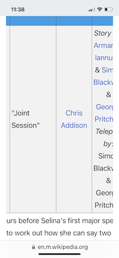
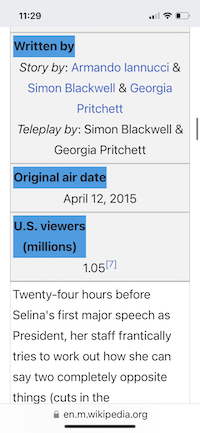

# wikipedia-no-horizontal-scroll-mobile-table

The formatting of Wikipedia episode tables on small screens forces readers to scroll horizontally and it drives me bonkers. This userscript shifts the burden to vertical scrolling.

## Before

## After

